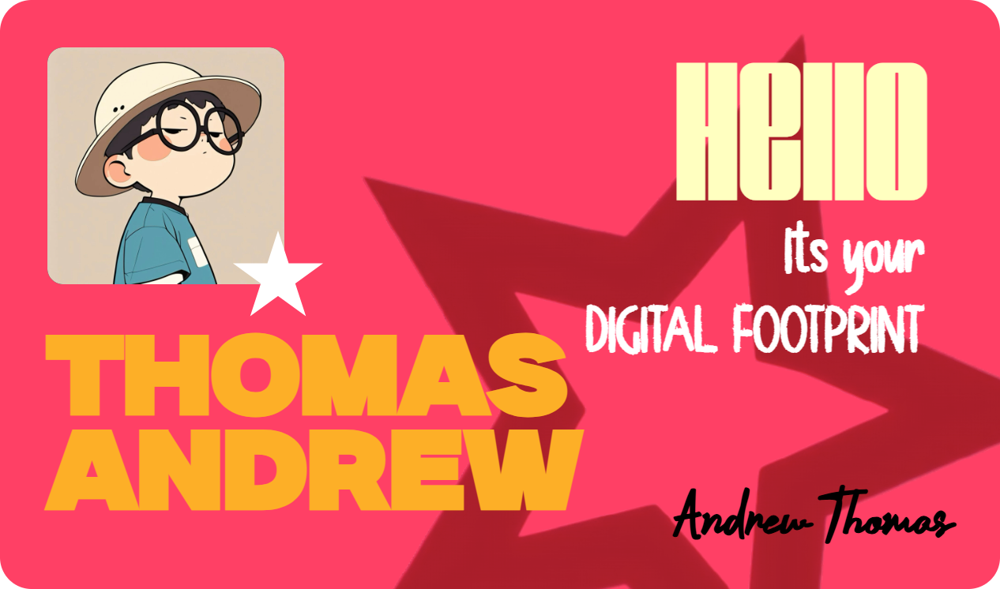

# ✦ Card Generator

A creative, browser-based **digital identity card generator** built with HTML, CSS, and JavaScript.

Enter your details, generate a personalized card, and export the final design as a PNG directly from the browser.

> **Your identity. Your footprint. Your card.**

---

## ✦ Preview

<!-- Add your project screenshot here -->



---

## ✦ Live Demo

**Live Demo:** *Coming soon*

---

## ✦ Features

* Generate a personalized digital card from user input
* Dynamic DOM-based card creation
* Custom typography using local font files
* Custom SVG graphic elements
* Profile image support through an image URL
* Smooth form exit and card entrance animations
* Automatic PNG export
* High-resolution image generation using `html-to-image`
* Responsive, visually focused interface
* No backend required

---

## ✦ Tech Stack

### Frontend

* HTML5
* CSS3
* Vanilla JavaScript

### Libraries

* [html-to-image](https://github.com/bubkoo/html-to-image)

### Assets

* Custom `.otf` typography
* SVG graphics
* Google Fonts

---

## ✦ How It Works

The application follows a simple client-side flow:

```text
USER
  │
  ▼
INPUT FORM
  │
  ├── First Name
  ├── Last Name
  └── Image URL
  │
  ▼
JAVASCRIPT
  │
  ├── Reads form values
  ├── Creates card elements
  ├── Inserts user information
  └── Loads profile image
  │
  ▼
DYNAMIC CARD
  │
  ├── HTML structure
  ├── Custom typography
  ├── SVG graphics
  └── CSS styling
  │
  ▼
HTML-TO-IMAGE
  │
  ▼
PNG DOWNLOAD
```

Everything happens directly in the browser.

No server-side processing is required.

---

## ✦ Project Structure

```text
Card-Generator/
│
├── .gitignore
├── README.md
├── index.html
│
├── css/
│   └── style.css
│
├── js/
│   └── script.js
│
└── assets/
    │
    ├── fonts/
    │   ├── brigold.otf
    │   ├── sign.otf
    │   ├── CB.otf
    │   └── Milker.otf
    │
    └── images/
        └── star.svg
```

---

## ✦ Getting Started

### 1. Clone the repository

```bash
git clone https://github.com/YOUR-USERNAME/card-generator.git
```

### 2. Open the project

```bash
cd card-generator
```

### 3. Run the project

Open `index.html` in your browser.

For the best development experience, use a local development server such as **VS Code Live Server**.

---

## ✦ Usage

1. Open the Card Generator.
2. Enter your first name.
3. Enter your last name.
4. Provide a profile image URL.
5. Submit the form.
6. Your personalized card is generated dynamically.
7. The generated card is exported as a PNG.

---

## ✦ Architecture

The project is intentionally kept lightweight and uses a simple client-side architecture.

### Input Layer

The form collects the information required to generate the card.

### Logic Layer

JavaScript:

* listens for form submission
* prevents the default form behavior
* reads user input
* creates DOM elements dynamically
* inserts the supplied information
* handles image loading
* controls the transition between the form and card
* generates the downloadable PNG

### Presentation Layer

CSS controls:

* card dimensions
* typography
* positioning
* colors
* spacing
* animations
* visual hierarchy

### Export Layer

`html-to-image` converts the generated DOM card into a PNG data URL, which is then downloaded through the browser.

---

## ✦ Design Direction

The project focuses on treating a small utility as a visual experience rather than just a functional form.

The design uses:

* expressive typography
* custom fonts
* strong visual hierarchy
* minimal interface structure
* motion between interface states
* a distinctive digital identity aesthetic

The goal is to make the generated result feel like a designed artifact rather than a standard HTML card.

---

## ✦ Challenges

### Dynamic DOM Generation

Instead of keeping a static card in the HTML and simply changing its text, the card is constructed dynamically with JavaScript.

This required handling:

* element creation
* element relationships
* classes and IDs
* user-generated content
* image sources
* DOM insertion

### Image Export

The generated card needs to be converted from a browser DOM element into an image.

This introduces additional considerations such as:

* image loading
* font loading
* external image URLs
* browser rendering timing
* CORS restrictions
* image resolution

### Custom Typography

The visual identity depends heavily on typography, which required working with both external and local font resources.

---

## ✦ What I Learned

Through this project, I practiced:

* DOM manipulation
* dynamic element creation
* form handling
* event listeners
* working with user input
* dynamically assigning attributes
* image handling
* CSS animations and transitions
* custom fonts
* browser-side image generation
* asynchronous browser APIs
* organizing frontend project assets

More importantly, the project helped me understand how HTML, CSS, and JavaScript work together as a small interactive application rather than as isolated technologies.

---

## ✦ Future Improvements

Planned improvements include:

* [ ] Upload images directly from the user's device
* [ ] Add multiple card designs
* [ ] Add card customization options
* [ ] Add font selection
* [ ] Add color themes
* [ ] Add download format options
* [ ] Improve mobile experience
* [ ] Add image cropping and positioning
* [ ] Improve external-image/CORS handling
* [ ] Add accessibility improvements
* [ ] Add automated testing
* [ ] Add continuous deployment
* [ ] Add contribution guidelines

---

## ✦ License

The source code of this project is available under the MIT License.

### Third-Party Assets

This project uses third-party fonts for local development and visual design.

The font files are not redistributed with this repository. Please obtain the fonts directly from their respective creators or licensors and review their individual licensing terms before using them.

The following fonts are used locally:

- Brigold
- CB
- Milker
- Sign

---

## ✦ Author

**Priyambada Pandey**

Frontend Developer & Creative Technologist

Building at the intersection of **web development, visual design, and creative experimentation.**

---

## ✦ Status

**Active Development**

This project is being developed and refined as part of my frontend development journey.
